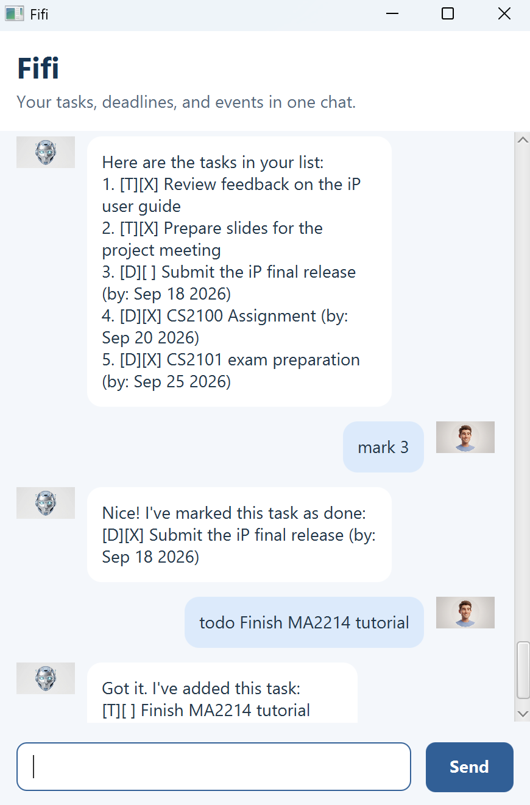

# Fifi

Fifi is a personal assistant chatbot for keeping track of todos, deadlines, and
events. Use its graphical chat interface or console interface to manage tasks,
find tasks, and view completion statistics.



## Getting started

Fifi requires Java 25. Place `fifi.jar` in the folder where you want to keep your
saved tasks, open a terminal there, and run:

```text
java -jar fifi.jar
```

To create the JAR from source, see [Building and running](#building-and-running).
Enter commands in the chat box and press **Enter** or click **Send**. For example:

```text
todo read book
list
mark 1
stats
```

Fifi saves changes automatically and highlights command errors with guidance for
correcting them. Enter `bye` to end the conversation and close the window.

See the [full user guide](docs/README.md) for installation instructions, all
commands, examples, task limits, and saved-data recovery.

## Developer setup

This is a project template for a greenfield Java project. The chatbot is named _Fifi_. Given below are instructions on how to use it.

### Setting up in Intellij

Prerequisites: JDK 25, update Intellij to the most recent version.

1. Open Intellij (if you are not in the welcome screen, click `File` > `Close Project` to close the existing project first)
1. Open the project into Intellij as follows:
   1. Click `Open`.
   1. Select the project directory, and click `OK`.
   1. If there are any further prompts, accept the defaults.
1. Configure the project to use **JDK 25** (not other versions) as explained in [here](https://www.jetbrains.com/help/idea/sdk.html#set-up-jdk).<br>
   In the same dialog, set the **Project language level** field to the `SDK default` option.
1. After that, locate the `src/main/java/fifi/Fifi.java` file, right-click it, and choose `Run Fifi.main()` (if the code editor is showing compile errors, try restarting the IDE). If the setup is correct, you should see something like the below as the output:
   ```
    _____ _  __ _
   |  ___(_)/ _(_)
   | |_  | | |_| |
   |  _| | |  _| |
   |_|   |_|_| |_|
   ```

**Warning:** Keep the `src\main\java` folder as the root folder for Java files (i.e., don't rename those folders or move Java files to another folder outside of this folder path), as this is the default location some tools (e.g., Gradle) expect to find Java files.

### Building and running

Install JDK 25 and make sure your terminal uses it (`java -version` should report
version 25). Use the included Gradle wrapper; a separate Gradle installation is
not required.

On Windows (PowerShell):

```powershell
.\gradlew.bat shadowJar
.\gradlew.bat run
```

On macOS or Linux:

```sh
./gradlew shadowJar
./gradlew run
```

`shadowJar` builds `build/libs/fifi.jar` with its dependencies. `run` launches the
GUI. You can also run the built JAR directly:

```text
java -jar build/libs/fifi.jar
```

For the console interface, run `Fifi.main()` in IntelliJ as described above, or:

```text
java -cp build/libs/fifi.jar fifi.Fifi
```

## Testing

### Automated tests and coding standards

On Windows:

```powershell
.\gradlew.bat check
```

On macOS or Linux:

```sh
./gradlew check
```

`check` runs the JUnit tests and Checkstyle checks. Use `test` instead of `check`
to run only JUnit tests. JavaFX presentation tests require a graphical display;
they are skipped on Linux when no display is available.

### Console UI tests

The [console UI test plan](test/ui-test-plan.md) contains commands, exact expected
responses, and saved-data checks. To run it automatically, use Java 25 and Python 3.
Build the JAR first so the test compiler can find the JavaFX dependencies.

On Windows (PowerShell):

```powershell
.\gradlew.bat shadowJar
$env:CLASSPATH = (Resolve-Path build/libs/fifi.jar).Path
$env:JDK_JAVA_OPTIONS = '-ea'
python .codex/skills/test-ui/scripts/run_ui_tests.py --main-class fifi.Fifi
```

On macOS or Linux:

```sh
./gradlew shadowJar
export CLASSPATH="$PWD/build/libs/fifi.jar"
export JDK_JAVA_OPTIONS='-ea'
python3 .codex/skills/test-ui/scripts/run_ui_tests.py --main-class fifi.Fifi
```

The runner stops at the first failed case and shows the expected and actual
output. It temporarily replaces `data/fifi.txt` for its test fixtures, so back up
any personal task data before running it and restore your backup afterwards.
